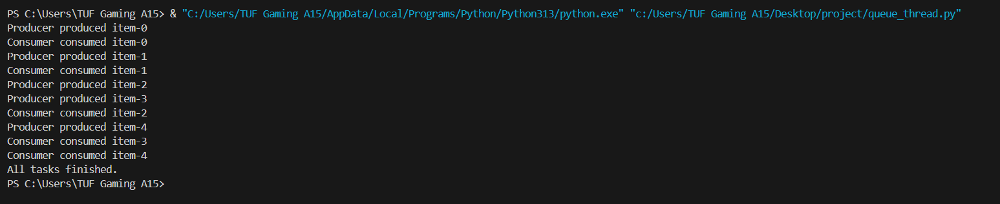

# Python 資料結構-多線程_隊列 11124141李佳穎

# 概要
一) 隊列的作用

1.Python的Queue主要用於多執行緒間的生產者與消費者通信

2.其底層是一種先進先出（FIFO）的資料結構（也可支援 LIFO、優先級等）

二) 為何要使用隊列

1.在多執行緒程式中，最重要的問題是:共享資料的安全性、執行緒之間的通訊

2.如果直接使用列表來存取資料，可能會導致多個執行緒同時讀寫，造成資料競爭

3.傳統做法需要手動加鎖或使用條件變數來避免衝突，較為繁瑣

三) 優勢

1.Python提供了queue.Queue資料型別，內建了執行緒安全機制，不需要額外加鎖
2.可確保每個資料元素在同一時間只會被單一執行緒訪問
3.支援FIFO或LIFO模式，簡化了生產者消費者模型的程式設計

# 代碼
import threading
import queue
import time

class Producer(threading.Thread):
    def __init__(self, q):
        threading.Thread.__init__(self)
        self.q = q

    def run(self):
        for i in range(5):
            item = f"item-{i}"
            self.q.put(item)  
            print(f"Producer produced {item}")
            time.sleep(1)

class Consumer(threading.Thread):
    def __init__(self, q):
        threading.Thread.__init__(self)
        self.q = q

    def run(self):
        while True:
            try:
                item = self.q.get(timeout=3) 
                print(f"Consumer consumed {item}")
                time.sleep(2)
            except queue.Empty:
                break

if __name__ == "__main__":
    q = queue.Queue()

    producer = Producer(q)
    consumer = Consumer(q)

    producer.start()
    consumer.start()

    producer.join()
    consumer.join()

    print("All tasks finished.")

# 執行結果

